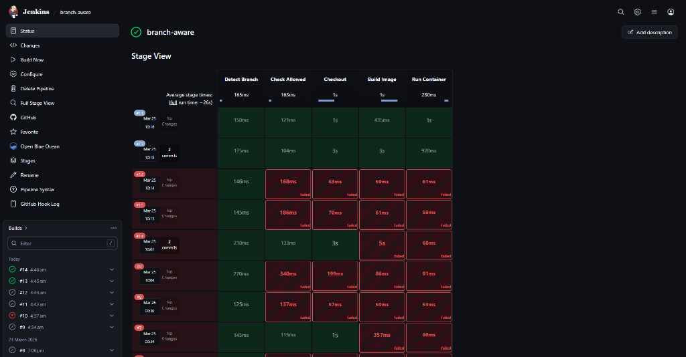
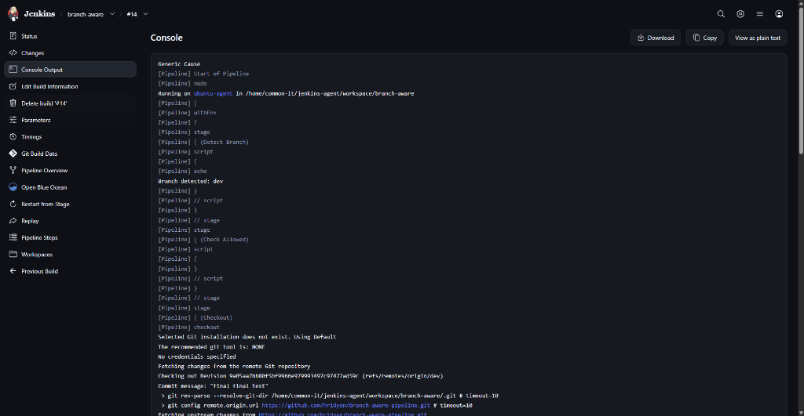
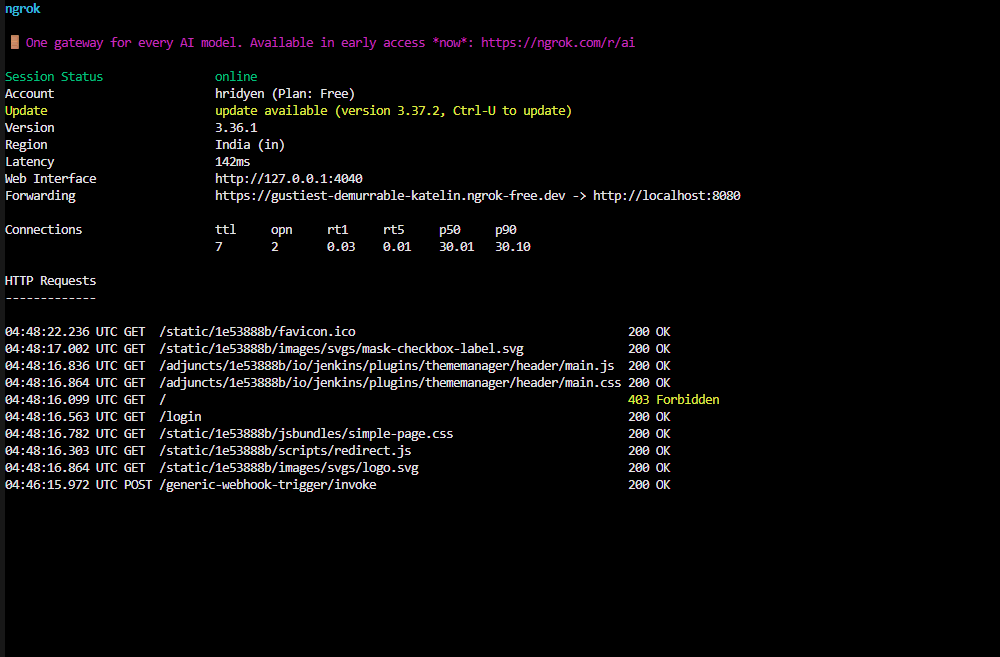

# Branch-Aware CI/CD Pipeline using Jenkins


A single Jenkins pipeline that detects Git branches dynamically using webhooks and performs controlled deployments only for selected environments (**dev** and **prod**).

## 🎯 Goal
To build a scalable, production-style CI/CD pipeline that avoids multibranch complexity and uses a centralized, branch-aware deployment strategy.

---

## ⚙️ Tech Stack

*   **Jenkins** (Pipeline as Code)
*   **Docker**
*   **Node.js (Express)**
*   **Git & GitHub**
*   **GitHub Webhooks**
*   **ngrok** (for local webhook exposure)
*   **Ubuntu** (Jenkins agent)

---

## 🔥 Key Features

*   **Single Unified Pipeline**: One pipeline handling multiple branches efficiently.
*   **Dynamic Branch Detection**: Extracts branch name directly from webhook payload (`ref`).
*   **Controlled Execution**: Strict guardrails allowing only `dev` and `prod` branch deployments.
*   **Automated Filtering**: Intelligently skips `stage`, `uat`, and `main` branches to maintain environment integrity.
*   **Docker-based Workflows**: Consistent builds and deployments using containerization.
*   **Dynamic Port & Name Allocation**: Auto-assigns ports (`3001` for dev, `3002` for prod) and unique container names.
*   **Distributed Builds**: Configured to run on Jenkins master + Ubuntu agent setup.
*   **Reliable Triggers**: Uses Generic Webhook Trigger for event-driven execution.

---

## 🏗️ Architecture

1.  **GitHub Repo**: Multiple branches (`dev`, `prod`, `stage`, `uat`, `main`).
2.  **Webhook Flow**: GitHub sends payload → **ngrok** tunnel → **Jenkins**.
3.  **Jenkins Logic**: **Generic Webhook Trigger** extracts the branch name.
4.  **Security**: Conditional logic blocks unauthorized branch deployments.
5.  **Agent Execution**: Jenkins agent pulls code, builds Docker image, and deploys container.

---

## 🔄 Workflow / How It Works

1.  Developer pushes code to any branch.
2.  GitHub triggers a webhook.
3.  Jenkins receives the webhook via **ngrok**.
4.  Pipeline extracts the branch name from the payload (`refs/heads/...`).
5.  **Validation**: If branch is `dev` or `prod`, the pipeline continues.
6.  **Abortion**: If branch is `stage`, `uat`, or `main`, the pipeline aborts gracefully.
7.  Jenkins agent checks out the correct branch.
8.  Docker image is built with environment-specific tagging.
9.  Container is deployed on assigned port with custom configuration.

---

## 🛠️ Setup Instructions

### Prerequisites
*   Jenkins installed (Docker or native)
*   Ubuntu agent configured and connected
*   Docker installed on the agent
*   GitHub repository with multiple branches
*   ngrok installed

### Installation
1.  Clone the repository:
    ```bash
    git clone https://github.com/hridyen/branch-aware-pipeline.git
    cd branch-aware-pipeline
    ```
2.  Create required branches: `dev`, `prod`, `stage`, `uat`, `main`.
3.  Add application code, `Dockerfile`, and `Jenkinsfile`.

### Configuration
1.  Install Jenkins plugins: **Git**, **GitHub**, **Generic Webhook Trigger**.
2.  Configure your Jenkins agent (node).
3.  Set up **Generic Webhook Trigger** with a secure token.
4.  Configure GitHub webhook using your **ngrok** URL.

### Running the Project
1.  Start ngrok: `ngrok http 8080`.
2.  Push code to the `dev` or `prod` branch.
3.  The Jenkins pipeline will trigger automatically.
4.  Verify the running container on the assigned port (`3001` or `3002`).

---

## 🔗 Integrations

*   **GitHub Webhooks**: Event-driven automation for real-time CI.
*   **ngrok**: Securely exposes local Jenkins instances to GitHub.
*   **Docker**: Ensures isolated and reproducible deployment environments.

---

## 📦 CI/CD Pipeline

### Trigger
*   GitHub Webhook via **Generic Webhook Trigger**.

### Build
*   Jenkins checks out the specific branch.
*   Docker image is built and tagged.

### Deploy
*   **dev**: Deployed on Port **3001**.
*   **prod**: Deployed on Port **3002**.

---

## 🌿 Branch Strategy

| Branch | Strategy | Deployment Port |
| :--- | :--- | :--- |
| `dev` | Development & Auto-Deploy | `3001` |
| `prod` | Production-Ready Deployment | `3002` |
| `stage` | Not allowed in pipeline | N/A |
| `uat` | Not allowed in pipeline | N/A |
| `main` | Source of truth (Manual deployment) | N/A |

---

## 📸 Screenshots / Output

### Jenkins Stage View
*Overview of the pipeline execution flow.*


### Successful Branch Detection
*Jenkins detecting 'dev' branch from webhook payload.*


### ngrok Local Tunnel
*Exposing local Jenkins to GitHub via ngrok.*


---

## 🚀 Future Improvements

*   [ ] Add **Automated Testing** stage (Unit & Integration).
*   [ ] Integrate **SonarQube** for code quality gates.
*   [ ] Add **Trivy** for container security scanning.
*   [ ] Implement **Manual Approval** step before `prod` deployment.
*   [ ] Migrate deployment to **AWS EC2/EKS** for cloud scalability.

---

## 📌 Learnings

*   Differentiating between webhook vs. manual triggers.
*   Implementing branch-aware logic in a single pipeline script.
*   Leveraging **Generic Webhook Trigger** for precise CI control.
*   Debugging distributed Jenkins builds and Docker socket permissions.
*   Managing environment-specific variables and port mapping.

---

## 🧠 Conclusion
This project demonstrates a real-world DevOps approach to building a scalable and maintainable CI/CD pipeline. By implementing branch-aware logic and webhook-driven automation, it showcases production-level practices that reduce complexity and improve deployment control.

---
Developed by [Hridyen](https://github.com/hridyen) | [LinkedIn](https://linkedin.com/in/hridyen)
