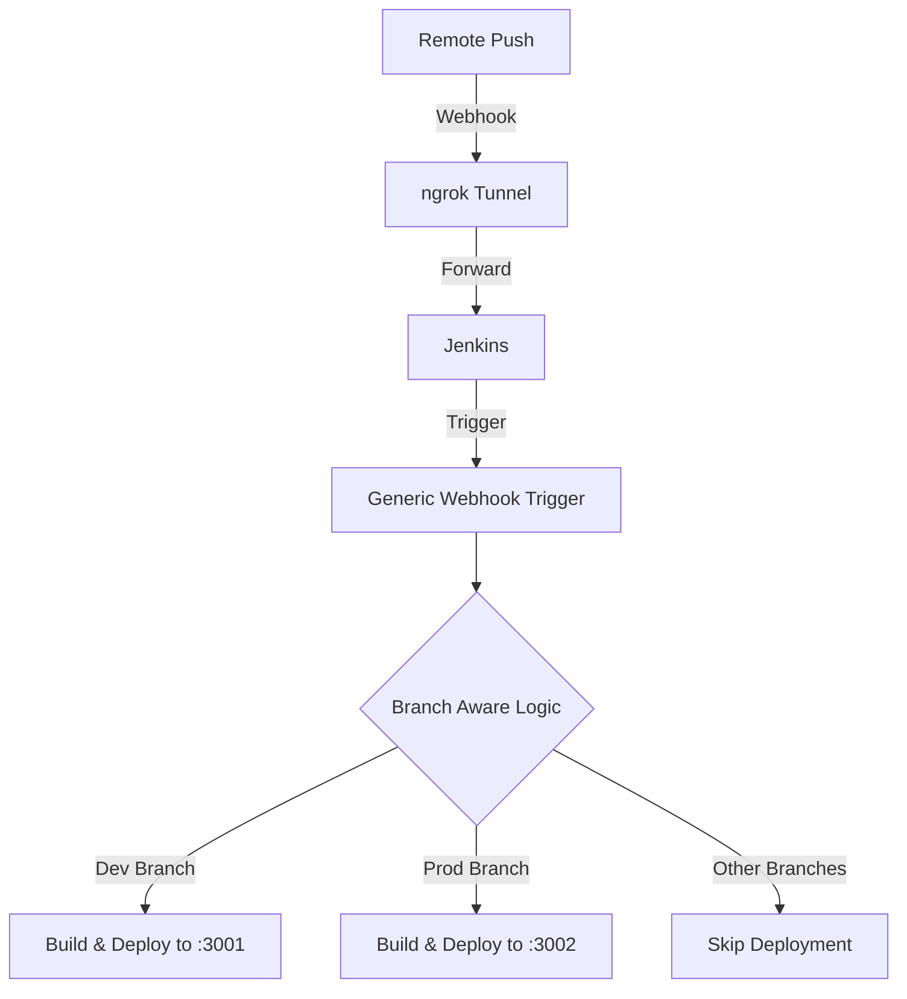

# Branch-Aware CI/CD Pipeline with Jenkins, Docker, and Webhooks


## 🚀 Project Overview

This project demonstrates a sophisticated, production-oriented CI/CD pipeline built with **Jenkins** and **Docker**. Unlike traditional multibranch pipelines, this system uses a **single Jenkins pipeline** that intelligently detects Git branches from GitHub webhook payloads and performs conditional deployments.

It features branch-specific logic, dynamic container naming, and automated environment-based port mapping, making it a robust solution for developers looking to manage multiple environments with minimal overhead.

## 🏗 Architecture & Workflow

The system follows a modern DevOps workflow where every git push is processed and deployed based on its target branch.



1.  **Developer Push**: A developer pushes code to GitHub.
2.  **Webhook Trigger**: GitHub sends a POST request with the payload (`ref`) to our Jenkins server (tunneled via **ngrok**).
3.  **Branch Detection**: Jenkins extracts the branch name from the webhook payload using the **Generic Webhook Trigger** plugin.
4.  **Conditional Deployment**: The pipeline validates the branch against an allowed list (`dev`, `prod`).
5.  **Dockerization**: An environment-specific Docker image is built.
6.  **Dynamic Execution**: A container is launched with unique naming and port mapping (`3001` for dev, `3002` for prod).

## ✨ Key Features

*   **Single Pipeline Architecture**: Centralized management for multiple branches without the complexity of multibranch pipeline configurations.
*   **Intelligent Branch Detection**: Uses GitHub webhook `ref` payload for real-time branch identification.
*   **Conditional Workflows**: Automatically skips deployments for untracked branches (e.g., `uat`, `stage`).
*   **Environment Isolation**: Uses dynamic Docker container naming and port mapping to prevent conflicts.
*   **Local Jenkins Integration**: Seamlessly integrates local Jenkins instances with GitHub using **ngrok**.

## 🛠 Tech Stack

*   **Jenkins**: Pipeline as Code (Groovy).
*   **Docker**: Containerization and deployment.
*   **Node.js (Express)**: Sample microservice showing environment-based behavior.
*   **GitHub Webhooks**: Real-time trigger mechanism.
*   **ngrok**: Secure tunnel for public webhook access.

## 📋 Prerequisites

*   Jenkins installed (with Docker and Git plugins).
*   Docker engine running on the Jenkins host.
*   [Generic Webhook Trigger](https://plugins.jenkins.io/generic-webhook-trigger/) plugin installed in Jenkins.
*   [ngrok](https://ngrok.com/) installed for local exposure.
*   GitHub repository with admin access for webhooks.

## ⚙️ Setup Instructions

### 1. Project Setup
Clone this repository and ensure all files are present:
```bash
git clone https://github.com/hridyen/branch-aware-pipeline.git
cd branch-aware-pipeline
```

### 2. Jenkins Setup (Docker-based)
Ensure Jenkins has permission to run Docker commands:
```bash
sudo usermod -aG docker jenkins
sudo systemctl restart jenkins
```

### 3. ngrok Setup
Expose your local Jenkins (default port 8080) to the internet:
```bash
ngrok http 8080
```
Copy the generated `https` URL (e.g., `https://random-id.ngrok.io`).

### 4. GitHub Webhook Configuration
1.  Go to **Repository Settings** > **Webhooks** > **Add webhook**.
2.  **Payload URL**: `https://<YOUR_NGROK_URL>/generic-webhook-trigger/invoke`
3.  **Content type**: `application/json`
4.  **Events**: Select `Just the push event`.

## 📜 Jenkins Pipeline Explanation

The `Jenkinsfile` follows a structured multi-stage logic:

1.  **Detect Branch**: Extracts the branch name from the GitHub `ref` payload.
2.  **Check Allowed**: Validates if the branch is `dev` or `prod`. If not, the pipeline aborts gracefully.
3.  **Build Image**: Builds a Docker image tagged with the branch name (e.g., `branch-app:dev`).
4.  **Run Container**:
    *   Removes existing containers of the same name.
    *   Assigns **3001** for `dev` and **3002** for `prod`.
    *   Passes the branch name as an environment variable to the application.

## 🌿 Branching Strategy

| Branch | Behavior | Resulting Container | Mapping |
| :--- | :--- | :--- | :--- |
| `dev` | **Deploy** | `branch-app-dev` | Port 3001 |
| `prod` | **Deploy** | `branch-app-prod` | Port 3002 |
| `uat` / `stg` | **Ignore** | N/A | Pipeline Aborted |

## 🕹 How It Works (End-to-End)

1.  Push a change to the `dev` branch.
2.  Jenkins starts the build immediately.
3.  Logs will show: `Branch detected: dev`.
4.  Access the app at `http://localhost:3001`.
5.  Push to `prod`, and access via `http://localhost:3002`.
6.  Push to any other branch, and watch Jenkins skip the deployment steps.

## 📸 Screenshots / Output

> [!NOTE]
> Add your actual terminal and browser screenshots here to showcase the live pipeline!

*   **Jenkins Console Output**: Showing branch detection and successful build.
*   **Docker Container List**: `docker ps` showing both `dev` and `prod` containers running.
*   **Web Console**: Browser snapshots showing "🔥 Running from branch: dev/prod".

## 🚀 Future Improvements

*   [ ] Implement **Slack/Discord Notifications** for build status.
*   [ ] Integration with **SonarQube** for code quality analysis.
*   [ ] Use of **Helm Charts** for Kubernetes-based deployment.
*   [ ] Implement private Docker Registry for image management.

## 🤝 Conclusion

This project serves as a practical blueprint for building scalable, branch-aware CI/CD pipelines. It demonstrates the power of Jenkins automation combined with Docker containerization to manage complex environment deployments efficiently.

---
Developed by [Hridyen](https://github.com/hridyen) | [LinkedIn](https://linkedin.com/in/hridyen)
